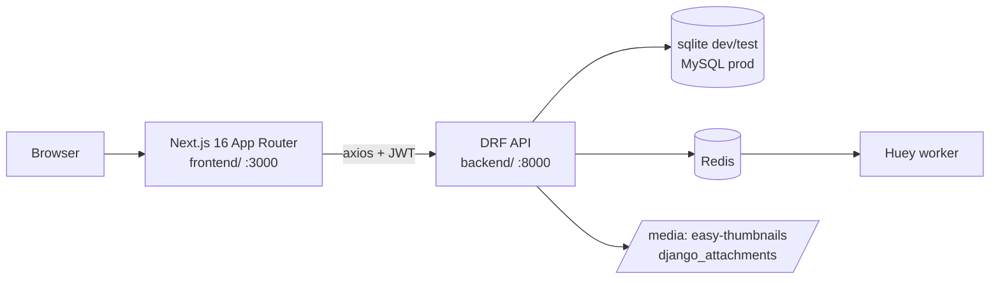
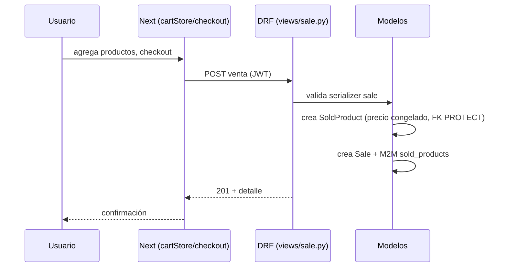
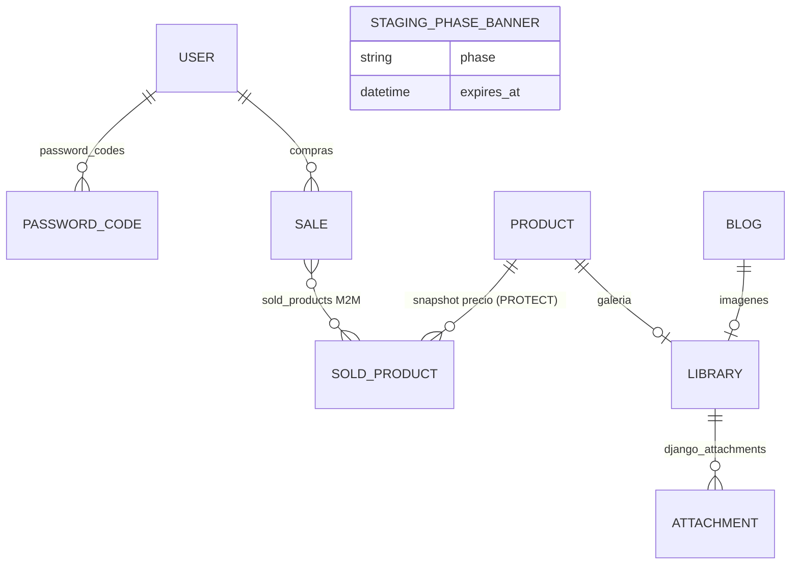
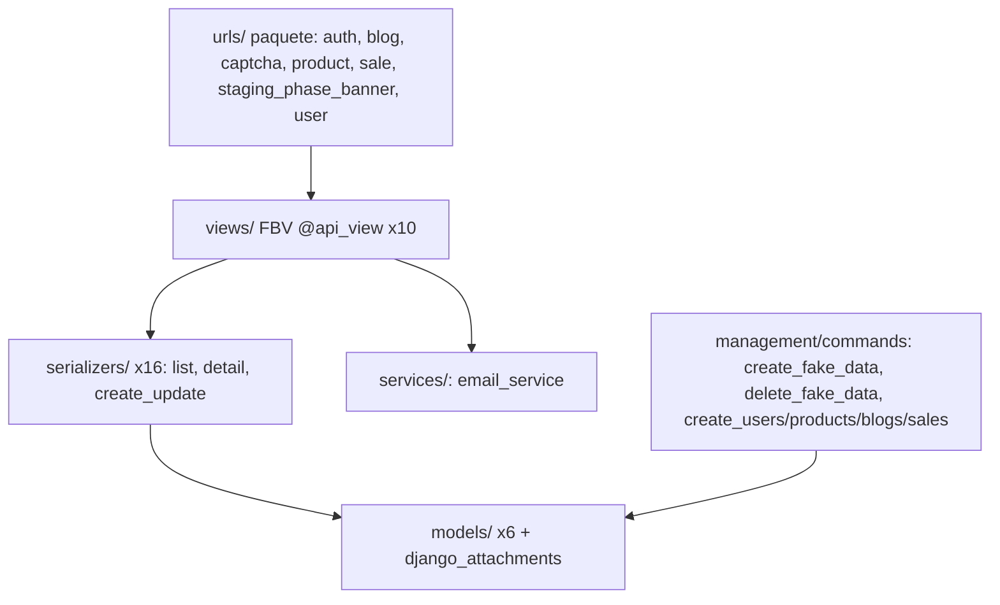
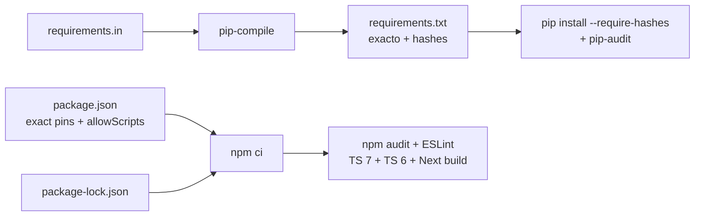

# Architecture — Base Django React Next Feature

> Memory Bank · actualizado 2026-08-27 (dependency refresh). Diagramas y pipeline verificados contra el código.

## Vista de sistema

- Frontend consume `api/*`; auth por JWT (`/api/token/` + refresh) guardado vía `lib/services/tokens`.
- `api/health/` identifica proyecto+entorno (verificación de probes del fleet).

## Flujo de request típico (compra)

## Modelo de datos (ER)

Modelos en `backend/base_feature_app/models/` (6): `user.py` (custom User + manager), `password_code.py`, `product.py`, `blog.py`, `sale.py` (Sale + SoldProduct), `staging_phase_banner.py`; más `django_attachments/models.py` (Library/Attachment).

## Capas backend

## Frontend (App Router)

- 12 páginas: `/`, `catalog`, `products/[productId]`, `blogs`, `blogs/[blogId]`, `checkout`, `sign-in`, `sign-up`, `forgot-password`, `admin-login`, `dashboard`, `backoffice` (+ `manual`).
- 6 stores Zustand (`lib/stores/`): auth, blog, cart, locale, product, stagingBanner. 2 hooks compartidos (`useRequireAuth`, `useHydrated`).
- 30 componentes/páginas `.tsx` entre `app/` y `components/` sin contar tests (48 incluyendo `__tests__/`); incluye `components/staging/` con el banner de fase.

## Deployment / CI (workflow actual)

- Template **sin despliegue**: sólo CI en GitHub Actions.
- `ci.yml`: backend-tests (lock drift + hashes + pip-audit + pytest sqlite) ·
  frontend-unit-tests (npm audit + scripts revisados + lint + TypeScript 7/6 +
  build + Jest) ·
  frontend-e2e-tests (venv + migrate + `create_fake_data 5` + Playwright
  chromium + flow-coverage reporter) · coverage-summary.
- `test-quality-gate.yml`: gate con `--junk-severity=error` contra `.junk-baseline.json`.
- Ramas protegidas: nunca commit directo a master; trabajo vía rama + PR.

## Supply chain de dependencias

- Runtimes compartidos por local y CI: Python 3.14.7 (`.python-version`) y
  Node 24.20.0 (`.nvmrc`); npm 11.19.0 se declara en `packageManager`.
- Las GitHub Actions están fijadas por SHA con el tag legible como comentario.
- Los scripts nativos npm sólo se autorizan por paquete y versión mediante
  `allowScripts`; un bump no hereda confianza automáticamente.

### Workflow actual (2026-08-27)

El dependency refresh integral quedó implementado secuencialmente en el PR #20:
cada commit funcional esperó backend, frontend unit, frontend E2E, quality gate
y coverage verdes antes del siguiente. El reporte canónico es
`audit-report.md`.
