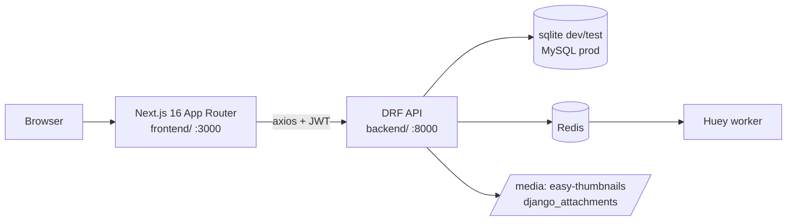
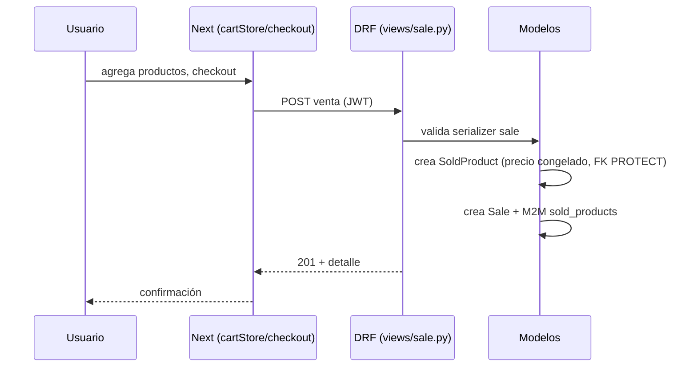
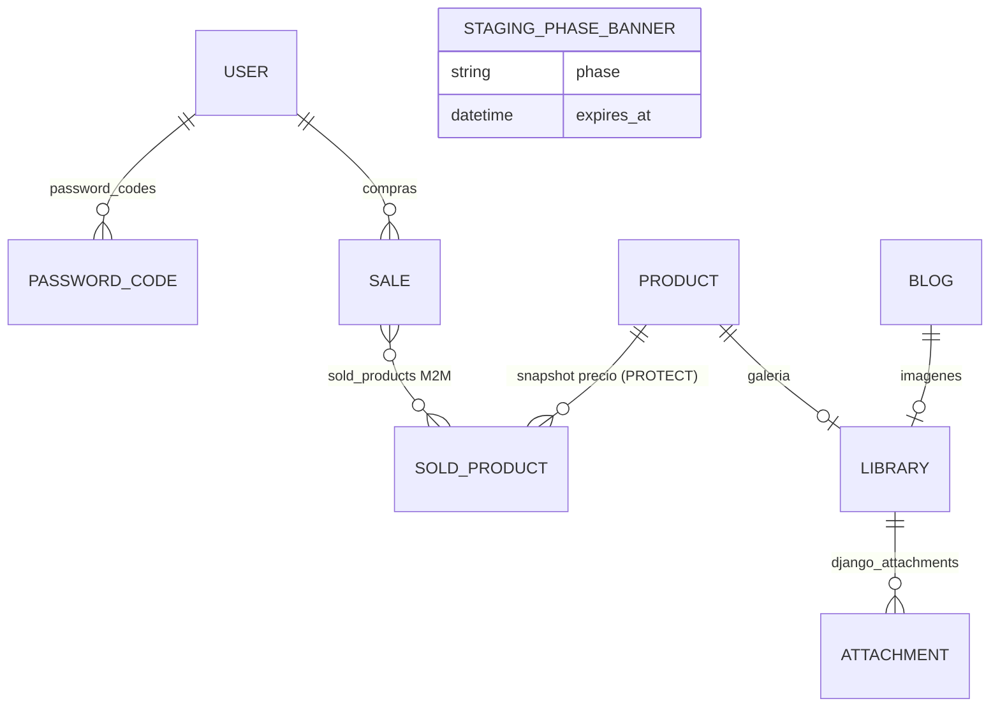
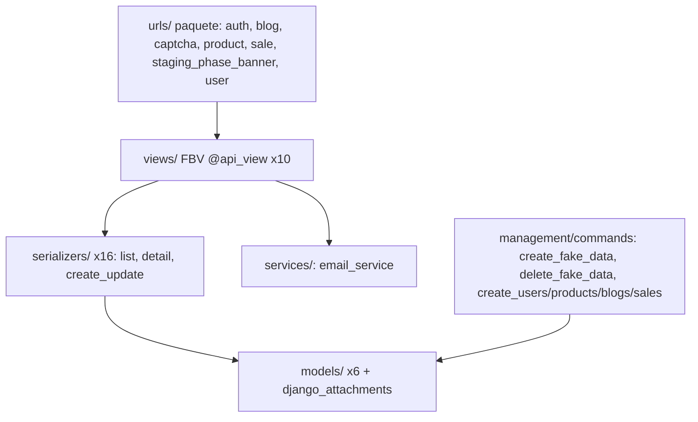

# Architecture — Base Django React Next Feature

> Memory Bank · actualizado 2026-08-13 (corrida /qa). Diagramas verificados contra el código.

## Vista de sistema

- Frontend consume `api/*`; auth por JWT (`/api/token/` + refresh) guardado vía `lib/services/tokens`.
- `api/health/` identifica proyecto+entorno (verificación de probes del fleet).

## Flujo de request típico (compra)

## Modelo de datos (ER)

Modelos en `backend/base_feature_app/models/` (6): `user.py` (custom User + manager), `password_code.py`, `product.py`, `blog.py`, `sale.py` (Sale + SoldProduct), `staging_phase_banner.py`; más `django_attachments/models.py` (Library/Attachment).

## Capas backend

## Frontend (App Router)

- 12 páginas: `/`, `catalog`, `products/[productId]`, `blogs`, `blogs/[blogId]`, `checkout`, `sign-in`, `sign-up`, `forgot-password`, `admin-login`, `dashboard`, `backoffice` (+ `manual`).
- 6 stores Zustand (`lib/stores/`): auth, blog, cart, locale, product, stagingBanner. 1 hook (`lib/hooks/useRequireAuth`).
- 30 componentes/páginas `.tsx` entre `app/` y `components/` sin contar tests (48 incluyendo `__tests__/`); incluye `components/staging/` con el banner de fase.

## Deployment / CI (workflow actual)

- Template **sin despliegue**: sólo CI en GitHub Actions.
- `ci.yml`: backend-tests (pytest sqlite) · frontend-unit-tests (Jest) · frontend-e2e-tests (venv + migrate + `create_fake_data 5` + Playwright chromium + flow-coverage reporter) · coverage-summary.
- `test-quality-gate.yml`: gate con `--junk-severity=error` contra `.junk-baseline.json`.
- Ramas protegidas: nunca commit directo a master; trabajo vía rama + PR (corrida QA actual: rama `qa/<fecha>`).

### Workflow actual (2026-08-13)

Corrida `/qa --apply` en curso: cierre de clases de outcome faltantes del flow map (6 flows partial, 3 módulos sin flows error/failure) + rewrites de weak findings del gate (44 warnings) + purga de junk. Ver `tasks/active_context.md`.
